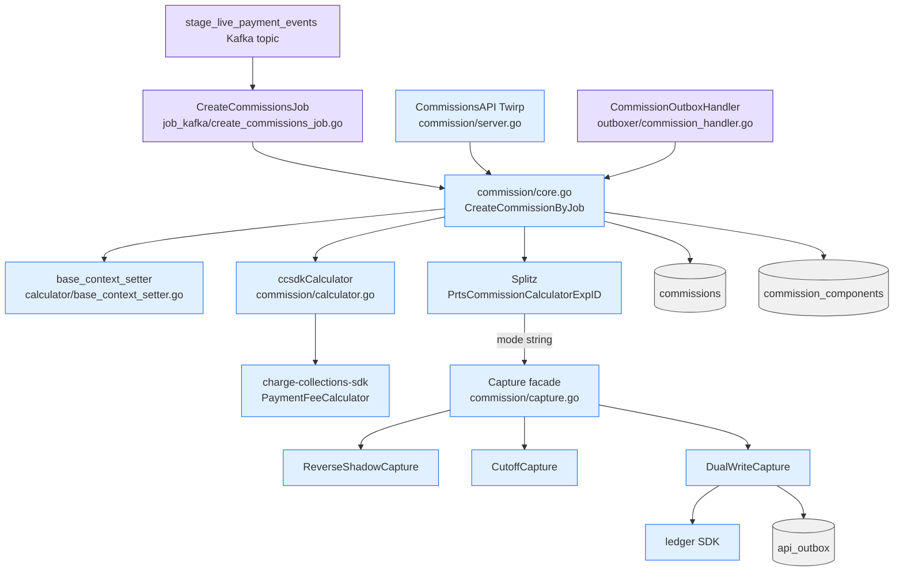

# Commission Engine — Overview

> Architecture, components, mode switching. The actual fee math is in `04_commission_calculation_paths.md`.

Repo root: `~/Desktop/git/partnerships`. Cite paths are relative to that root.

---

## What "commission" means here

A **commission** is a partner's earning when a payment is captured under one of their sub-merchants. It's stored in the `commissions` table and eventually rolled up into a monthly `commission_invoice` (see `05_invoice_lifecycle.md`) which triggers a settlement to the partner.

A **subvention** is the inverse — when the *partner* pays Razorpay (rather than earning) for a particular pricing arrangement. Same table, modeled with `Debit` instead of `Credit`. Controlled by `Model` field, value `subvention` vs default `commission` (`internal/commissions/commission/model.go:14, 27`).

---

## Components



The five places commissions can come into being:

| Entry point | Triggered by | File:line |
|---|---|---|
| `CreateCommissionsJob` (Kafka) | `payment.captured` events on topic `stage_live_payment_events` | `internal/job_kafka/create_commissions_job.go:38, 72` |
| `CommissionOutboxHandler` (outbox retry) | Re-enqueued after Kafka job failure | `internal/outboxer/commission_handler.go:47` |
| `CommissionsAPI.CreateCommission` (Twirp manual) | Operator/admin tooling | `proto/commissions/commission/v1/commission_api.proto:12-19` → `internal/commissions/commission/server.go` |
| `CommissionsAPI.Capture / CaptureByPartner / BulkCaptureByPartner` (Twirp) | State transition: `created` → `captured` | `core.go:139, 160-180`; bulk in `commission/server.go` |
| Refund reversals (programmatic) | Refund event triggers `CreateReversalByJob` | `internal/commissions/commission/core.go:451-499` (gated by Splitz `CommissionReversalForRefundsExpID`) |

---

## The commission entity

✅ Verified at `internal/commissions/commission/model.go:24-46`:

```go
type Commission struct {
    spine.SoftDeletableModel             // ID, CreatedAt, UpdatedAt, DeletedAt

    SourceId        string               // payment_id (or refund_id for reversals)
    SourceType      string               // "payment" | "refund"
    PartnerId       string
    ConfigId        string               // partner_config row id
    ConfigType      string               // hardcoded "partner_config"
    MerchantId      string               // sub-merchant id
    Type            string               // "implicit" | "explicit"
    TransactionId   string               // settlement transaction id (after capture)
    RecordOnly      int                  // 1 = no money movement
    Model           string               // "commission" (default) | "subvention"
    Debit           int64                // subvention path
    Credit          int64                // commission path = fee - tax (or negative)
    Currency        string               // 3-char (only INR observed)
    Fee             int32                // paise
    Tax             int32                // paise
    Status          common.CommissionStatus
    Notes           datatype.JSON
    SettlementId    string
    SettledAt       int                  // unix sec
    CommissionComponent CommissionComponent  // FK
}
```

### Status enum (✅ verified at `internal/common/constants.go:52-54`)

| Value | Meaning |
|---|---|
| `created` | Calculated and persisted; not yet captured |
| `captured` | Mode-specific capture step has run; ready for invoicing |

There are only two states. The lifecycle of a real commission is `created → captured`. There is **no separate "settled"** status — `settled_at` and `settlement_id` are populated when the eventual settlement happens, but the row remains in `captured` status.

### Source classification (`internal/commissions/source/model.go:9-14`)

| Constant | Value | Use |
|---|---|---|
| `PaymentSourceType` | `"payment"` | Standard commission |
| `RefundSourceType` | `"refund"` | Reversal commission (negative amount) |
| `InPersonChannel` | `"in_person"` | Source channel |
| `OnlineChannel` | `"online"` | Source channel |

Disabled source channels (`internal/commissions/commission/core.go:50`):
```go
DisabledCommissionSourceChannels = []string{source.InPersonChannel}
```
→ In-person POS payments are **explicitly excluded** from commission creation. Only online/empty channels qualify.

Valid source types (`core.go:49`):
```go
ValidCommissionSourceTypes = []string{source.PaymentSourceType}
```
→ Only `payment`-source events trigger commission creation. Refunds go through the separate reversal path (not via this filter).

---

## Database schema

### `commissions` table (✅ verified at `internal/database/migrations/20221010155829_create_commissions.go:15-42`)

| Column | Type | Notes |
|---|---|---|
| `id` | char(14) PK | Razorpay ID |
| `source_id` | char(14) NOT NULL | payment_id usually |
| `source_type` | varchar(60) NOT NULL | `payment` / `refund` |
| `partner_id` | char(14) NOT NULL | |
| `config_id` | char(14) NOT NULL | partner_configs.id |
| `config_type` | varchar(100) NOT NULL | "partner_config" |
| `type` | varchar(50) DEFAULT 'implicit' | implicit / explicit |
| `status` | varchar(60) NOT NULL | created / captured |
| `debit`, `credit` | bigint(20) NOT NULL | paise |
| `currency` | char(3) NOT NULL | INR |
| `fee`, `tax` | int(10) NOT NULL | paise |
| `transaction_id` | char(14) NULL | settlement transaction |
| `record_only` | tinyint(1) DEFAULT 0 | |
| `notes` | text NOT NULL | |
| `model` | varchar(60) DEFAULT 'commission' | |
| `settlement_id` | char(14) NULL | |
| `settled_at` | int NULL | unix sec |
| `created_at`, `updated_at`, `deleted_at` | int / int / int NULL | soft delete |

**Indexes:**
- PK `(id)`
- `commissions_source_id_index` on `(source_id)`
- `commissions_partner_id_created_at_index` on `(partner_id, created_at)`

> ❗ **No unique constraint on `(source_id, source_type, type)`.** Idempotency relies entirely on a 60s mutex lock on `prts:cc:<payment_id>` (`internal/job_kafka/create_commissions_job.go`) plus the consumer's `MaxRetries: 1`. If the same payment event is delivered twice with >60s between attempts and the lock has been freed, two commission rows are theoretically possible. The job code at line 121 treats `spine.UniqueConstraintViolation` as success — but no constraint exists to *raise* that error, so this is dormant defensive code.

### `commission_components` table (✅ verified at `internal/database/migrations/20221010155845_create_commission_components.go:15-35`)

One row per commission, captures the pricing rule snapshot used at calculation time:

| Column | Type |
|---|---|
| `id` | char(14) PK |
| `commission_id` | char(14) NOT NULL FK |
| `merchant_pricing_plan_rule_id` | char(14) |
| `merchant_pricing_percentage` | int(10) unsigned DEFAULT 0 |
| `merchant_pricing_fixed` | int(10) unsigned DEFAULT 0 |
| `merchant_pricing_amount` | int(11) NOT NULL |
| `commission_pricing_plan_rule_id` | char(14) |
| `commission_pricing_percentage` | int(10) unsigned DEFAULT 0 |
| `commission_pricing_fixed` | int(10) unsigned DEFAULT 0 |
| `commission_pricing_amount` | int(11) NOT NULL |
| `pricing_feature` | varchar(60) NOT NULL | "payment", "online", "in_person" |
| `pricing_type` | varchar(60) NOT NULL | "PRICING" (variable) or "fixed" |

This is what makes commissions auditable — you can recompute fees from the snapshot without depending on whether the rule has since changed in the SDK.

---

## The Twirp `CommissionsAPI`

Defined at `proto/commissions/commission/v1/commission_api.proto:12-19`. Methods:

| RPC | Purpose | Handler |
|---|---|---|
| `CreateCommission` | Manual / programmatic creation | `internal/commissions/commission/server.go` |
| `Get` | Read by ID | `internal/commissions/commission/server.go` |
| `List` | List by filters | `internal/commissions/commission/server.go` |
| `Capture` | Single capture | `core.go:139` |
| `CaptureByPartner` | All `created` commissions for one partner | `core.go:160-180` |
| `BulkCaptureByPartner` | Bulk variant | `internal/commissions/commission/server.go` |

Capture is the state transition `created → captured`. It's also what triggers ledger journal entries in `ModeDualWrite` (see below).

There is also `CommissionAnalyticsAPI` (`proto/.../commission_analytics_api.proto`) for read-only analytical queries — backed by Trino via `pkg/trino/`.

---

## The mode switch (THE central design decision)

The biggest piece of complexity in the commission engine is that fee calculation has **two co-existing implementations** plus several "shadow" / "compare" / "dual-write" runtime modes for safely migrating from one to the other.

### Where the mode is chosen

```go
// internal/commissions/commission/core.go:987-1006 (✅ verified)
func (c *Core) getExperimentMode(ctx context.Context, merchantId string) common.Mode {
    variant, _ := c.splitzProvider.GetVariant(ctx,
        config.GetConfig().Splitz.ExperimentIds.PrtsCommissionCalculatorExpID,
        evalRequest{merchantId: merchantId, ...})
    return common.Mode(variant.Name)  // variant name IS the mode string
}
```

Mode constants (✅ verified at `internal/common/constants.go:15-18`):

```go
ModeReverseShadow Mode = "reverse-shadow"
ModeCuttOff       Mode = "cutoff"          // <— typo preserved in code
ModeShadow        Mode = "shadow"
ModeDualWrite     Mode = "dual-write"
```

Empty / unknown mode falls into the legacy path (immediate capture without mode-specific logic).

### What each mode does

The high-level branching lives at `internal/commissions/commission/core.go` lines 700–745:

| Mode | Behavior |
|---|---|
| empty / `ModeShadow` | Mark commissions as `captured` immediately before saving (lines 704-710). Single-path execution; the legacy way. |
| `ModeReverseShadow` | Save in `created` state, then call `captureCore.GetByMode(ctx, mode).Capture(ctx, comms)` (lines 716-720). Capture facade then dispatches to `ReverseShadowCapture` (`internal/commissions/commission/capture.go:42-67`). |
| `ModeCuttOff` | Same dispatch as above, hits `CutoffCapture`. This is the "new way is canonical" mode. |
| `ModeDualWrite` | Hits `DualWriteCapture`. Additionally if the DCS feature `commission_ledger_reverse_shadow` is enabled (`internal/commissions/ledger/service.go:261-264`), creates ledger journal entries via the ledger SDK (lines 723-741 in core.go). |

The capture facade pattern lives at `internal/commissions/commission/capture.go:42-67`:

```go
// SelectCapture returns the right capture impl for the mode.
// The trio is ReverseShadowCapture, CutoffCapture, DualWriteCapture.
```

Each mode has its own `*_process_invoice.go` counterpart in `internal/commissions/commission_invoice/` that's structured the same way (see `05_invoice_lifecycle.md`).

### What "ReverseShadow" actually means here

Despite the name, no explicit shadow-vs-live diff comparison code was found in the partnerships repo. The pattern appears to be:
- **Cutoff** = canonical write only (the new path)
- **DualWrite** = write to both paths
- **ReverseShadow** = save commissions in `created` state, run the new capture path, but the legacy ledger writing is the one that's "shadow"
- **Shadow** = legacy path runs canonically, new path runs in shadow

⚠️ Inferred — the exact semantic of `ReverseShadow` is contextual to ledger writes and is most precisely defined by reading `commission_ledger_reverse_shadow` DCS flag handling at `internal/commissions/ledger/service.go:261-264`.

### Reading by mode

The same Mode enum is used in:
- Partner KYC dual-write (`internal/partner/kyc/access_state/dual_write_upsert.go`)
- Invoice processing (`commission_invoice/cutoff_process_invoice.go`, `dualwrite_process_invoice.go`, `reverseshadow_process_invoice.go`)
- Ledger service (`commissions/ledger/service.go`)

This is a recurring **partnerships idiom**: a Splitz experiment returns a variant whose name is one of these four strings, and downstream code dispatches behavior on it.

---

## Failure Modes & Recovery

| Failure | What happens | Recovery |
|---|---|---|
| Splitz unreachable when fetching mode | `getExperimentMode` returns empty string → falls into legacy single-path mode | Self-healing — Splitz outage doesn't break commission creation, just defaults to legacy path |
| Calculator returns 0 fee | Commission row is **not created** at all (`internal/commissions/commission/calculator.go:182-188`) | Intentional — see `04_…_paths.md` for details |
| CC SDK calculator not configured for the payment method | Returns `ErrCCSDKCalculatorNotConfigured`, no commission created (test at `slit/.../ccsdk_commission_test.go:98-134`) | Operator must configure the rule chain in `ccsdk` provider config |
| Kafka consumer fails | `MaxRetries: 1` → goutils worker dead-letters; an outbox row is also written via `OnError` handler (`create_commissions_job.go:130-144`) | Outbox handler (`commission_handler.go:47`) re-invokes the same `CreateCommissionByJob` from a separate goroutine |
| Mutex lock contention | Second concurrent attempt waits or fails the lock acquisition; first attempt completes, second sees existing rows | Self-healing |
| Capture step (mode-specific) fails | Commissions left in `created` state | `CommissionsAPI.Capture` / `CaptureByPartner` can be invoked manually (or by a cron — ❗ verify cron exists) |
| Ledger journal creation fails in DualWrite mode | Commission row is `captured` (DB committed) but no ledger journal | Reconciliation by `LedgerAcknowledgmentJob` (`internal/job_kafka/ledger_acknowledgment_event.go:79`) which consumes ledger outbox CDC and updates commission + api_outbox atomically |
| Refund reversal — `CommissionReversalForRefundsExpID` disabled | `CreateReversalByJob` returns nil silently (lines 472-479) | Once experiment is enabled, requires a backfill job to catch up missed refunds; ❗ such a backfill is not visibly checked-in |

---

## Confidence

- ✅ Verified: entity model + table schema, status/source enums, Twirp method list, mode constants, mode dispatch lines, all file:line refs.
- ✅ Verified: dual-mode design and `commission_ledger_reverse_shadow` DCS flag.
- ⚠️ Inferred: precise ReverseShadow vs Shadow semantics — these are convention-driven and most precisely defined by reading the four `*Capture` implementations at `internal/commissions/commission/capture.go` and the `*_process_invoice.go` files in invoice module.
- ❗ Needs verification: existence of a cron that captures `created` commissions if mode-specific Capture fails.
