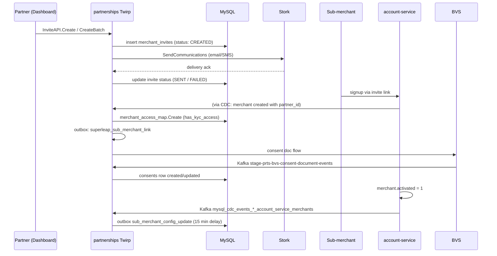

# Sub-Merchant Access, Invites, Consent

> The partner ↔ sub-merchant relationship: how a sub-merchant gets onboarded under a partner, how access is mapped, how consent works, how LOS (capital products) plug in.

Repo root: `~/Desktop/git/partnerships`. Citations relative.

---

## High-level flow



---

## Models

### `MerchantAccessMap` (✅ verified at `internal/merchant_access_map/model.go:13-26`)

```go
type MerchantAccessMap struct {
    spine.SoftDeletableModel
    MerchantID    string  // sub-merchant id
    EntityOwnerID string  // partner id
    EntityID      string  // generic entity reference
    EntityType    string
    HasKycAccess  bool
}

func (MerchantAccessMap) TableName() string { return "merchant_access_map" }
```

#### Schema (✅ verified at `internal/database/migrations/20230218214702_create_merchant_access_map.go:14-30`)

| Column | Type |
|---|---|
| `id` | char(14) PK |
| `merchant_id` | varchar/char(14) NOT NULL |
| `entity_owner_id` | char(14) NOT NULL |
| `entity_id` | char(14) |
| `entity_type` | varchar |
| `has_kyc_access` | tinyint(1) DEFAULT 0 |
| `created_at`, `updated_at`, `deleted_at` | int / nullable |

**Indexes:** `merchant_access_map_merchant_id_foreign`, `merchant_access_map_entity_owner_id_foreign`, plus `created_at`, `updated_at`, `deleted_at` indexes.

The `has_kyc_access` flag is the linchpin: it determines whether the partner can see/manage the sub-merchant's KYC.

### `Invites` (✅ verified at `internal/merchant/invites/model.go:23-36`)

```go
type Invites struct {
    spine.SoftDeletableModel
    PartnerID     string
    Name          string
    Email         string
    ContactNo     string
    Product       string
    EmailStatus   invitesv1.InviteStatus
    ContactStatus invitesv1.InviteStatus
    Meta          datatype.JSON
    InviterUserId string
    InviterEmail  string
}

func (Invites) TableName() string { return "merchant_invites" }
```

#### Status enum (✅ verified at `internal/merchant/invites/model.go:61-101`)

```
InviteStatus_CREATED   ← initial
InviteStatus_SENT      ← terminal-success
InviteStatus_FAILED    ← terminal-fail
```

There are two parallel statuses, one per channel: `EmailStatus` and `ContactStatus`. Either can fail independently.

### `Consent` (✅ verified at `internal/consent/model.go:25-44`)

```go
type Consent struct {
    spine.SoftDeletableModel
    MerchantID  string
    Status      string   // not a defined enum — driven by BVS event states
    RequestID   string
    ConsentFor  string   // entity needing consent
    EntityID    string
    EntityType  string
    Metadata    Metadata // ip_address, user_agent, template_id, event, max_retry_count
    RetryCount  int16
}

func (Consent) TableName() string { return "consents" }
```

`Status` is a string but no enum constants are defined for it in the repo (`❗ not found`); it tracks BVS-driven state (e.g., `pending`, `acknowledged`, etc.).

---

## Twirp APIs

### `MerchantAccessMapAPI` — `internal/merchant_access_map/server.go`

| Method | Line | Purpose |
|---|---|---|
| `Create` | 26 | Create a new partner-merchant edge |
| `Update` | 56 | Toggle access flags |
| `Get` | 110 | Read by ID |
| `List` | 163 | Filter by partner / merchant |
| `GetAffiliatedPartnersForSubmerchant` | 221 | Reverse lookup: which partners can see this merchant? |

Registered at `internal/routes/routes.go:184`.

### `InviteAPI` — `internal/merchant/invites/server.go`

| Method | Line | Purpose |
|---|---|---|
| `Create` | 75 | Create one invite |
| `Resend` | 51 | Resend an existing invite (re-trigger Stork) |
| `List` | 132 | List by filters |
| `CreateBatch` | 181 | Bulk creation |
| `GetCount` | 242 | Count for dashboard counters |
| `SendCommunications` | 108 | Internal job handler — invokes Stork |

Registered at `internal/routes/routes.go:291`.

### `ConsentAPI` — `internal/consent/`

Registered at `internal/routes/routes.go:330` as `merchantv1.ConsentAPIServer` with:
- Core: `internal/consent/` (15 files)
- Transformer: `consent.NewTransformers()` (registered at `routes.go:328`)
- Outbox support: wired through `boot.Outbox` (`routes.go:329`)

The main public processing entry point is the BVS Kafka consumer (below) rather than a direct Twirp method — consent state is mostly driven by the BVS event stream.

### `MerchantAPI`, `MerchantApplicationAPI`, etc.

Several other Twirp services exist (see `01_overview.md` for the full list). The most-used in this domain are the three above.

---

## Sub-merchant onboarding sequence

The end-to-end sequence between an invite and a fully-onboarded sub-merchant under a partner:

### 1. Invite creation

```go
// internal/merchant/invites/server.go:75 — Create()
// Inserts a row in merchant_invites with EmailStatus=CREATED, ContactStatus=CREATED
// Returns the invite ID
```

The partner's dashboard calls this Twirp method (typically through the Razorpay API monolith).

### 2. Communication

```go
// internal/merchant/invites/server.go:108 — SendCommunications()
// Invoked as an internal job (not directly by external Twirp callers)
// Calls Stork to send the invite email + SMS
// Updates EmailStatus / ContactStatus to SENT or FAILED
```

### 3. Sub-merchant signup

The sub-merchant signs up via the link in the invite email. This flow is **not in the partnerships repo** — it's in the api monolith (`api/`) or `account-service`. The new merchant gets a `partner_id` set in the `merchants` table.

### 4. CDC propagates to partnerships

`mysql_cdc_events_*_account_service_merchants` Kafka topic carries the new merchant row. The partnerships service consumes this:

- `internal/job_kafka/partner_type_change_events.go` — when `partner_type` changes (covered in `02_partner_lifecycle.md`)
- `internal/job_kafka/merchant_activation_events.go` — when `activated` flips 0 → 1 (next section)

### 5. Access map row created

```go
// internal/merchant_access_map/server.go:26 — Create()
// Triggered programmatically (typically by the api monolith) once
// the partner-merchant relationship is confirmed
// Inserts merchant_access_map row with has_kyc_access flag
```

This is also an outbox-tracked write — see `outboxer/merchant_access_map_handler.go` and the global handler. On insert, a Superleap CDC event is queued.

### 6. KYC starts

Triggered by the `MerchantActivationEventJob` (next section).

---

## Merchant activation event

This is the consumer that "kicks off" sub-merchant readiness when account-service marks the merchant as activated.

```go
// internal/job_kafka/merchant_activation_events.go (✅ verified)
// Topic config:    merchant_activation_event
//                  → mysql_cdc_events_stage_account_service_merchants
// Handler:         (job *MerchantActivationEventJob) Handle(ctx) error    line 88
// MaxRetries:      1
// Timeout:         60s

// IsMerchantActivatedEvent(event) — line 47-49
//   true iff: Data.Activated == 1 AND Old.Activated == 0
//   (only acts on the 0→1 transition, not subsequent updates)
```

When triggered:

```go
// merchant_activation_events.go:111-114, 117 (✅ verified)
payload := SubMerchantConfigUpdatePayload{...}
outboxJobOptions := WithDelay(15 * time.Minute)   // OutboxDelayInMs = 15*60*1000 (line 19)
outbox.Send(ctx, payload, outboxJobOptions)
```

Why the 15-minute delay? Without this, the partnerships outbox would race the api-monolith / account-service post-activation processing (settlement schedule setup, etc.). The delay gives upstream services time to settle before partnerships propagates settings. The settlement schedule + holiday config gets pulled into the `partner_configs` and applied to the sub-merchant.

---

## LOS (Lending / Capital products)

The sub-package `internal/merchant/los/` plugs capital product eligibility into the access flow.

```go
// internal/routes/routes.go:295-298 (✅ verified)
losValidator := los.NewValidator()
losCore      := los.NewCore(merchantAccessMapCore, cache, losProvider,
                            splitzProvider, gimliClient, storkClient, merchantSvc)
losServer    := los.NewServer(losCore, losValidator)
losHandler   := <handler from losServer>
```

LOS:
- Reads access map state to determine sub-merchant eligibility
- Calls Gimli (`internal/provider/gimli/`) for capital readiness
- Uses Splitz to gate which partners are eligible for the capital product
- Sends notifications via Stork

It does not write to merchant_access_map directly — it consumes the existing rows and surfaces eligibility decisions through its own Twirp handlers.

❗ More detail on the LOS internals would require reading 10+ files in `internal/merchant/los/`. The contract from outside is: given a sub-merchant id and partner id, LOS returns capital eligibility + product enrollment state.

---

## Consent

Two distinct flows under the same package:

### 1. BVS document consent (driven by Kafka)

```go
// internal/job_kafka/bvs_consent_document_event.go (✅ verified)
// Topic: stage-prts-bvs-consent-document-events    (config/default.toml:34)
// Handler: (h *Handler) Handle(ctx) error          line 52
//   → consent.Core.ProcessBVSConsentDocumentAckEvent(ctx, bvsMessageData)   line 58
// MaxRetries: 0     ← single attempt only, then dead-letter
// Timeout: 60s
// Payload: consent.BvsMessageData                                            line 16
```

This consumer processes BVS sending a consent ack event when the user has consented to a document (e.g., partner T&Cs, sub-merchant agreement). It updates the `consents` row's `Status` and `RetryCount`.

> ⚠️ `MaxRetries: 0` means **a single delivery failure will lose the consent ack**. There's no automatic re-fetch; recovery requires either:
> - BVS replaying the event (their responsibility)
> - Manual investigation + reconstruction

### 2. ConsentAPI Twirp methods

Programmatic consent state queries from the dashboard. Handlers in `internal/consent/server.go` (full list ❗ not deeply read; the typical methods will be `Get`, `List`, `Create`).

---

## Failure Modes & Recovery

| Failure | Behavior | Recovery |
|---|---|---|
| Invite Stork delivery fails | EmailStatus/ContactStatus → FAILED | `InviteAPI.Resend` (manually triggered, e.g., partner support) |
| Invite stays in CREATED for >5min | In-progress window per `model.go:104-109`; treated as in-progress | If queue is backed up, rerun `SendCommunications` |
| `merchant_access_map.Create` succeeds but `superleap_sub_merchant_link` outbox row insertion fails | Whole transaction rolls back (outbox writes are GORM-plugin-driven on commit, `database/plugins/outbox_events.go:46-77`) | Self-healing — caller retries Create |
| `merchant_access_map.Create` succeeds, but Superleap call fails | Outbox row remains; goutils outbox retries | Library-managed |
| `merchant_activation_events` consumer fails | `MaxRetries: 1`. After exhaustion, dead-letter | Manual replay by re-publishing the CDC event or calling internal admin endpoints |
| `bvs_consent_document_event` consumer fails | `MaxRetries: 0` — **immediate loss** | ❗ No automatic recovery. The most fragile consumer in the domain. |
| Submerchant config update outbox handler fails after 15-min delay | `submerchant_config_update_handler.go` retries; SQS-backed retry batch job at `internal/batch_jobs/api_outbox_retry.go` runs every 10min (older than 10min) | Eventually consistent within ~30 minutes |
| LOS gimli call fails | LOS API returns error; sub-merchant sees "eligibility unavailable" | Retry from caller; LOS does not internally retry |
| Consent row state desync (BVS says ack, but our row didn't update) | Operator can use `ConsentAPI.Update` (if such method exists) or direct DB fix | ❗ No reconciliation job visible |

### Invite expiry

There is **no explicit expiry timestamp** on `merchant_invites`. The `model.go:104-109` "in-progress" window of 5 minutes is for retry coordination, not user-facing expiry. The invite link itself is in the api monolith / account-service, with its own TTL.

### Reject / KYC rejection paths

KYC rejection is handled in `partner_kyc_access_state` (state `"rejected"`). The `rejection_count` column tracks how many times the same merchant has been rejected. There's no automatic block after N rejections — that's policy elsewhere (probably PGOS or BVS).

---

## Confidence

- ✅ Verified: all model fields, table schemas, status enums, Twirp method names + line refs, Kafka topic strings, retry config.
- ⚠️ Inferred: the user-visible flow steps (invite → signup → activation) — the partnerships repo doesn't own the signup path, so the sequence diagram's middle steps are the contract surface, not implementation details.
- ❗ Needs verification: full list of `ConsentAPI` Twirp methods; whether any reconciliation cron exists for missed BVS consent acks; precise behavior under MaxRetries=0 dead-letter (where do these go in goutils worker?).
