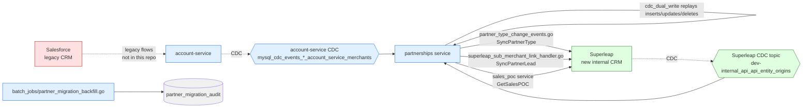

# Salesforce → Superleap Migration

> The state of the in-flight migration as evidenced by code, *not* the migration plans on Desktop. Plans are referenced for context; the code is the truth.

Repo root: `~/Desktop/git/partnerships`. Cite paths are relative.

---

## TL;DR — current state

✅ **The migration is in dual-write mode, not yet cutover.**

- Partnerships still gets partner-related data from the legacy path (account-service / Salesforce-backed flows).
- It also (a) consumes Superleap CDC and replays it locally, and (b) outbound-syncs certain events to Superleap.
- Each outbound sync is gated by a Splitz experiment, so the sync rollout is per-merchant / per-partner controllable.
- There is **no "cutover-complete" boolean** anywhere in the repo. Cutover would manifest as: removing the dual-write code paths and disabling the Splitz gates.

Local migration plan documents (referenced, not the source of truth):

- `~/Desktop/git/partnerships-salesforce-superleap-migration-plan.md` (~14 KB)
- `~/Desktop/git/partnerships-superleap-cdc-implementation-plan.md` (~7.5 KB)
- `~/Desktop/git/salesforce-to-superleap-migration-plan.md` (~29 KB)

---

## The four moving parts



The four pieces:

1. **`cdc_dual_write` Kafka consumer** — inbound: replays Superleap data into partnerships' MySQL.
2. **`partner_type_change_events` Kafka consumer** — outbound: pushes partner type changes to Superleap.
3. **`superleap_sub_merchant_link_handler` outbox handler** — outbound: notifies Superleap when a sub-merchant is linked to a partner.
4. **`partner_migration_backfill` batch job** — one-shot: backfills `partner_migration_audit` from a CSV.

Plus reads:
5. **`sales_poc` service** — read-through to Superleap for sales POC info on demand.

---

## 1. CDC dual-write inbound (`cdc_dual_write.go`)

✅ Verified at `internal/job_kafka/cdc_dual_write.go:1-59`.

```go
const (
    JobMaxRetries     = 3
    JobTimeoutSeconds = 10
)

type CdcDualWrite struct {
    log *cdc.Log
}

func (e *CdcDualWrite) Handle(ctx context.Context) error {
    return deps.CdcServer.ProcessLog(ctx, e.log)   // line 47-49
}
```

**Topic** (✅ verified at `config/default.toml`): `dev-internal_api_api_entity_origins` (stage value; prod will differ).

**ProcessLog** dispatches per CDC operation type at `pkg/cdc/core.go:8-10` (✅ verified):

```go
const (
    OpInsert = "insert"
    OpUpdate = "update"
    OpDelete = "delete"
)

// repo dispatch
case OpInsert: c.repo.Insert(ctx, log.Table, log.Data)
case OpUpdate: c.repo.Update(ctx, log.Table, log.Data, log.PkValues, log.PkColumns)
case OpDelete: c.repo.Delete(ctx, log.Table, log.Data, log.PkValues, log.PkColumns)
```

**What gets replayed:** Whatever tables the CDC subscription includes. The list is **not hardcoded in the consumer code**; it depends on Superleap's CDC config + which topics the subscription includes. ❗ To know the actual table list, check the Superleap-side CDC config (out-of-repo).

**Failure handling:**
- `MaxRetries: 3, Timeout: 10s` — three retries with a tight 10s timeout.
- After exhaustion, message is dead-lettered.

**What this gives partnerships:** A local replica of Superleap-owned data, queryable without round-trips to Superleap. This is preparation for cutover (when partnerships becomes the read-of-record locally).

---

## 2. Partner type change outbound (`partner_type_change_events.go`)

When account-service updates a merchant's `partner_type`, this consumer pushes the change to Superleap.

✅ Verified at `internal/job_kafka/partner_type_change_events.go`.

```go
// Topic config: partner_type_change_event  (config/default.toml:35)
// Actual upstream: mysql_cdc_events_*_account_service_merchants (Maxwell CDC of merchants table)
// MaxRetries: 1, Timeout: 60s

func (job *PartnerTypeChangeEventJob) Handle(ctx context.Context) error {  // line 120
    // Filter at IsPartnerTypeChanged() (line 58)
    // Then:
    return job.syncPartnerTypeChange(ctx)   // line 128
}

func (job *PartnerTypeChangeEventJob) syncPartnerTypeChange(ctx context.Context) error {
    // Splitz gate (lines 131-136)
    enabled := deps.SplitzProvider.IsExperimentEnabled(ctx,
        config.GetConfig().Splitz.ExperimentIds.SuperleapKafkaMigrationExpID,
        merchantID, nil, false)
    if !enabled { return nil }  // SILENTLY skips

    // Outbound call (line 139)
    return deps.SuperleapClient.SyncPartnerType(ctx, &superleap.SyncPartnerTypeRequest{...})
}
```

**Why the experiment gate.** This lets the team roll out Superleap sync gradually — say, 1% of partners first, monitor, then ramp. The gate is per-merchant.

**Failure mode** (already covered in `02_partner_lifecycle.md`): if the experiment is disabled, events are silently skipped — no audit row in partnerships' DB, just structured logs. Once the experiment is enabled later, missed events stay missed unless someone runs the backfill.

---

## 3. Sub-merchant link outbound (`superleap_sub_merchant_link_handler.go`)

When a `merchant_access_map` row is created (partner ↔ sub-merchant edge formed), Superleap is notified.

✅ Verified at `internal/outboxer/superleap_sub_merchant_link_handler.go:1-172`.

```go
// Triggered: outbox row of type SuperleapSubMerchantLinkOutboxPayloadName
// (written by the GORM plugin when merchant_access_map gets a CREATE)
// Filter: only DBCreate operation                              line 70

type SuperleapSubMerchantLinkPayload struct {
    ID         string
    Operation  string
    MerchantID string
    PartnerID  string
}

func (h *SuperleapSubMerchantLinkHandler) Handle(...) error {
    // 1. Fetch merchant details from WDA (Warm Data Access on TiDB)
    //    for product=banking                                    lines 96-101

    // 2. Splitz gate: SuperleapMigrationExpID                   lines 107-108
    if !enabled { return nil }

    // 3. Call Superleap                                         line 145
    err := h.superleapClient.SyncPartnerLead(ctx, &superleap.SyncPartnerLeadRequest{
        MerchantID:   payload.MerchantID,
        PartnerID:    payload.PartnerID,
        SourceDetail: ...,
    })
    // Metrics: success/failure counters (lines 155, 164)
    return err
}
```

**Why WDA lookup.** Banking-product context for the merchant has to be fetched at the time of sync because Superleap needs the full lead picture, not just the partner-merchant edge. WDA is queried because TiDB holds the warm copy of merchant data for fast reads.

**Why DBCreate-only.** Updates and deletes don't make sense for "link this lead to Superleap" — only the initial create matters.

---

## 4. Partner migration audit + backfill batch job

### The audit table

✅ Verified at `internal/partner_migration_audit/model.go:1-62`.

```go
type PartnerMigrationAudit struct {
    spine.SoftDeletableModel  // line 14 — ID, CreatedAt, UpdatedAt, DeletedAt

    PartnerId      string  // line 15
    OldPartnerType string  // line 16
    NewPartnerType string  // line 17
    Status         string  // line 18
}

// Table: partner_migration_audit  (line 21)
```

The full picture is "who moved from what to what, and was it successful". Status values are not enumerated in the model file — they're driven by the backfill flow.

### Twirp surface

✅ Verified at `internal/partner_migration_audit/server.go`:

| RPC | Line |
|---|---|
| `CreatePartnerMigrationAudit` | 24 |
| `GetLastPartnerMigrationAudit` | 50+ |

### The backfill batch job

✅ Verified at `internal/batch_jobs/partner_migration_backfill.go`.

```go
const batchSize = 20  // line 25

func (p *PartnerMigrationBackfillJob) Execute(ctx) error {  // line ~50
    fileName := unmarshal(params).fileName                       // lines 56-60

    list := p.fetchPartnerMigrationDataFromCSV(ctx, fileName)    // line 62

    for batch in list (chunked by 20) {
        err := p.partnerMigrationAuditRepo.CreateInBatches(ctx, batch, batchSize)  // line 80
        log success / failure                                                       // lines 89-92
    }
}
```

**How it's used:** Operator uploads a CSV file (S3 or similar location, reference passed via job params). Each row is one historical partner-type transition. Backfill writes them into `partner_migration_audit` so subsequent reporting can see the full migration picture even for partners whose change events were skipped (e.g., when the Splitz experiment was disabled).

**This is the manual reconciliation lever** for missed `partner_type_change_events`.

---

## 5. Data comparator + data fetcher

✅ Verified directories: `internal/batch_jobs/data_comparator/` and `internal/batch_jobs/data_fetcher/`.

These exist as scaffolding for migration validation and data syncing. Specifically:

- `data_comparator/` — compares records between Salesforce/legacy and Superleap, presumably to flag drift before cutover. Files: `core.go`, `comparator.go`, `reporter.go`. ❗ Not deeply read.
- `data_fetcher/` — fetches records from a source (legacy or Superleap) into staging tables. Files: `core.go`, `modifiers.go`. ❗ Not deeply read.

Their existence is itself the most useful evidence: it confirms the team is investing in pre-cutover data quality validation.

---

## 6. Superleap client

✅ Verified at `pkg/superleap/client.go` and `pkg/superleap/models.go`:

| Method | Line | Purpose |
|---|---|---|
| `SyncPartnerType(ctx, req)` | 19 | Used by `partner_type_change_events.go` |
| `SyncPartnerLead(ctx, req)` | 21 | Used by `superleap_sub_merchant_link_handler.go` |
| `GetSalesPOC(ctx, merchantID)` | 26 | Used by `partner/sales_poc/service.go` |

Initialization at `internal/boot/handler.go:502-503`:

```go
superleapClient := superleap.NewClient(config.Conf.Superleap)
```

Config block: `config.Conf.Superleap` of type `superleap.Config` (fields include `ClientConfig`, `Auth.APIKey`). ❗ Full config struct not deeply read.

---

## Splitz experiments controlling the migration

| Experiment ID (Go field) | Where used | What disabling it means |
|---|---|---|
| `SuperleapKafkaMigrationExpID` | `partner_type_change_events.go:131-136` | Partner type changes from CDC are NOT pushed to Superleap |
| `SuperleapMigrationExpID` | `superleap_sub_merchant_link_handler.go:107-108` | Sub-merchant link create events are NOT synced to Superleap |

(There may be others under `pkg/splitz/config.go` — only these two are confirmed in migration code paths.)

DCS feature flags relevant to the migration / dual-write:

| Flag | Where used | What it does |
|---|---|---|
| `commission_ledger_reverse_shadow` | `internal/commissions/ledger/service.go:261-264` | Whether reverse-shadow commission mode also writes ledger journals (related but distinct from Superleap migration — same dual-write design, different domain) |

---

## What "cutover" would look like

Code-evidenced: the team would need to do the following to declare cutover-complete:

1. Remove the Splitz gates from `partner_type_change_events.go:131-136` and `superleap_sub_merchant_link_handler.go:107-108` — making Superleap sync unconditional.
2. Decommission `cdc_dual_write.go` and `pkg/cdc/repo.go` — partnerships becomes the source of truth instead of replicating Superleap.
3. Migrate any remaining reads currently going through `account-service` CDC to Superleap-direct or local-DB-direct.
4. Remove `data_comparator` / `data_fetcher` once drift is no longer a concern.
5. Keep `partner_migration_audit` and the backfill job around as a forensic/audit asset.

None of these have happened in the code as of the current scan.

---

## Failure Modes & Recovery

| Failure | Behavior | Recovery |
|---|---|---|
| Superleap CDC topic delayed | Partnerships' local replica goes stale | Self-healing on resume |
| `cdc_dual_write` consumer fails | `MaxRetries: 3` (10s timeout) → DLQ | Need to replay from earlier offset (operator action) |
| `partner_type_change_events` Splitz disabled | Events silently skipped, no audit | Backfill via `partner_migration_backfill.go` once experiment is enabled |
| `superleap_sub_merchant_link` Splitz disabled | Sub-merchant lead never created in Superleap | No automatic recovery in this repo. ❗ Possibly a Superleap-side reconciliation, but not visible here |
| Superleap API error in `SyncPartnerType` / `SyncPartnerLead` | Returns error to job/handler | Standard retry semantics: 1 retry for `partner_type_change`; outbox library retry for the sub-merchant handler |
| Backfill job CSV malformed | Per-batch error logged with partner IDs | Operator inspects logs, fixes CSV, re-runs |
| `partner_migration_backfill` partial failure (some batches succeed, some fail) | Returns error if any batch failed (line 95) but **completed batches are persisted** | Idempotency: re-running with the same CSV will likely skip rows already in `partner_migration_audit` (depending on the implementation of `CreateInBatches`; ⚠️ not fully verified — may double-insert) |
| Data comparator finds drift | Reporter logs drift records | Operator action — there's no automatic remediation |

### Idempotency on the backfill

`partner_migration_audit` has a PK (`id`, char(14)) but the `id` is generated server-side. ❗ If the backfill is re-run, are the IDs deterministic from the input CSV row? If not, re-runs will create duplicates. Worth verifying before any actual re-run.

---

## Reading the migration plans

The three Markdown documents on Desktop (created Feb 10–18, 2026) describe intent. The code is what's actually running. If the plan and the code disagree, **trust the code** for current behavior; **trust the plan** for the vision of where it's headed.

If you're investigating a "did this partner get migrated?" question:

1. Check `partner_migration_audit` for any row matching the partner.
2. Check Coralogix logs for `partner_type_change_events` and `superleap_sub_merchant_link` handlers around the relevant time.
3. Check the Splitz experiments above — specifically: was the gate enabled for this merchant?
4. If gate was disabled and event was missed, run `partner_migration_backfill` with a one-row CSV.

---

## Confidence

- ✅ Verified: all 4 moving parts (CDC consumer, partner type change consumer, sub-merchant link handler, backfill job), Superleap client method list + lines, Splitz experiment names + line refs, audit table model.
- ⚠️ Inferred: idempotency of `partner_migration_backfill` re-runs (depends on ID generation logic not fully traced); table list replicated by `cdc_dual_write` (depends on Superleap subscription, out of repo).
- ❗ Needs verification: production CDC topic name (current evidence is stage); idempotency of backfill re-runs; whether any Superleap-side reconciliation closes the loop on missed events.
