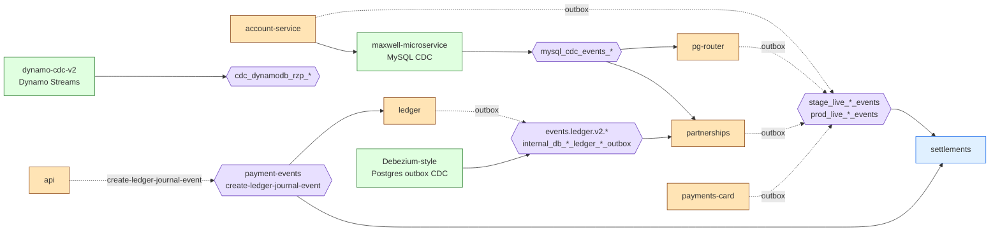

# Kafka at Razorpay

> How Razorpay actually uses Kafka — topic naming, the outbox pattern, CDC sources, consumer libraries. Not a Kafka tutorial.

This doc consolidates Kafka usage observed across all repos in the system map. Every claim is grounded in code/config; ✅ / ⚠️ / ❗ tags as usual.

---

## Topology summary



---

## Library convention

All Go services use `github.com/razorpay/goutils/event-streaming/v2` (a.k.a. `goutils/kafka/v2`). Stork uses `goutils/event-streaming` directly. The api monolith uses a PHP wrapper.

Standard pattern per service:
- Producer side: write to a domain-local `outbox_jobs` table inside the same DB transaction as the business write. A relay process (`goutils/outbox/v4`) tails the table and produces to Kafka.
- Consumer side: register a job with retry config + handler signature; framework handles offset commit, mutex acquisition, retries.

---

## Topic naming patterns

### CDC topics (Maxwell — MySQL → Kafka)

```
mysql_cdc_events_<env>_<service>_<table>     (✅ verified at multiple call sites)
```

Examples observed:
- `mysql_cdc_events_prod_pg_router_outbox_jobs` (prod)
- `mysql_cdc_events_stage_account_service_merchants` (stage)
- `mysql_cdc_events_prod_partnerships_*` (per partnerships outbox tables)

Stage MSK has an extra `rzp.` prefix due to multi-tenant cluster:
```
rzp.mysql_cdc_events_<env>_<service>_<table>   (stage)
mysql_cdc_events_<env>_<service>_<table>       (prod, Strimzi)
```

(✅ Verified from `maxwell-microservice` README + scan.)

### CDC topics (DynamoDB streams)

```
cdc_dynamodb_rzp_<service>_<mode>           (✅ verified at dynamo-cdc-v2)
```

Example: `cdc_dynamodb_rzp_qrcodes_live`. Plus DLQ variants.

### Domain event topics

```
<env>_live_<domain>_events                  (e.g., stage_live_payment_events, prod_live_payment_events)
<env>_test_<domain>_events                  (test mode variants)
```

Observed examples:
- `stage_live_payment_events` (PG Router → consumed by partnerships' `create_commissions_job`)
- `stage_live_route_events`, `stage_live_offers_events`, `stage_live_growth_events`, `stage_live_charge_collections_events`, `stage_live_affordability_events` (settlements consumes these)
- `stage_live_transaction_record_events` (settlements produces)
- `stage_live_import_transaction_update` (settlements produces)
- `prod_live_payment_events` (pg-router prod)

### Ledger topics

```
events.ledger.v2.{test|live}                (ledger's own event stream)
internal_db_<env>_ledger_<db>_outbox.public.outbox_jobs_<consumer>   (Debezium of ledger's outbox table — partnerships consumes one of these)
```

### Bespoke / legacy topics (api monolith)

The api PHP monolith has a few topics with different naming:
- `order-update-event`
- `send-notification-2-merchants-customers`
- `create-payment-transaction-event`
- `create-ledger-journal-event`
- `commission-invoice-events-to-kafka`
- `payment-events` (settlements' ledger_processor consumes this)

(✅ Verified at `api/config/kafka_consumer.php` and `api/config/app.php`.)

### DLQs

Pattern: `<topic>_dlq` or `<topic>_<consumer>_dlq`.

Examples (✅ verified at pg-router prod config):
- `prod_live_payment_events_order_paid_webhook_dlq`
- `prod_live_payment_events_payment_webhook_dlq`

---

## The outbox pattern (universal)

This is the **single most important pattern** to understand for triaging async issues.

```
+-------------+                    +--------------+               +-------+
|  Service    |  same DB tx        |  outbox_jobs |   relay loop  | Kafka |
|  business   | ─────────────────> |  table       | ─────────────>|       |
|  write      |                    +--------------+               +-------+
+-------------+
```

1. Service writes its business row + an outbox row in **one DB transaction**. If the transaction commits, both are present; if it rolls back, neither is.
2. A separate **relay process** (`goutils/outbox/v4`) tails the outbox table, produces to Kafka, and marks the row published.
3. Failures inside the relay are retried with exponential backoff. Max attempts is library-configured (e.g., pg-router uses 3, `config/func-live.toml:310`).

### Why every service does this
- Avoids the dual-write problem (DB committed, Kafka publish failed → silent inconsistency).
- The whole platform converges on this pattern. Notably:
  - `partnerships/internal/database/plugins/outbox_events.go:46-77` — GORM plugin auto-fills outbox on syncable table writes
  - `pg-router/cmd/workers/outbox_relay/main.go` — the relay loop
  - `ledger/cmd/outbox_relay/main.go` — same idea
  - `account-service/internal/outbox/handlers/` — handler-driven publishes

### Outbox table conventions
- `id`, `payload_name`, `payload_serialized` (or `payload`), `retry_count`, `created_at`, `updated_at`
- Some have `status` (pending/published), some don't (api_outbox in partnerships notably doesn't — see `partnerships/07_outbox_and_kafka.md`)
- Some are partitioned by `created_at` for retention

---

## CDC sources

Three CDC mechanisms feed Kafka:

| CDC | Source | Destination topic pattern | Repo |
|---|---|---|---|
| Maxwell | MySQL binlog | `mysql_cdc_events_<env>_<service>_<table>` (+ optional `rzp.` prefix on stage) | `maxwell-microservice` |
| dynamo-cdc-v2 | DynamoDB Streams | `cdc_dynamodb_rzp_<service>_<mode>` (+ DLQ) | `dynamo-cdc-v2` |
| Debezium-style (Postgres) | Postgres outbox tables | `internal_db_<env>_<service>_<db>_outbox.public.outbox_jobs_<consumer>` | (configured per service) |

Maxwell is microservice-deployed: legacy mode reads config from S3 templates with runtime env substitution; modern mode does the same but with per-service deployments.

dynamo-cdc-v2 (Java/KCL) supports up to 5 streams per deployment, with multi-schema mapping for compressed Dynamo column names → readable names → final binlog/SQL names.

---

## Cluster topology

- **Stage**: AWS MSK with `rzp.` topic prefix (multi-tenant cluster).
- **Prod**: Strimzi-deployed Kafka, no prefix.

(✅ Verified at `maxwell-microservice/README` + scan.)

---

## Per-service quick reference

### partnerships consumers (✅ verified at `config/default.toml:29-36`)

| TOML key | Topic value |
|---|---|
| `commission_create` | `stage_live_payment_events` |
| `partner_type_change_event` | `partner_type_change_event` (mapped) |
| `merchant_activation_event` | `mysql_cdc_events_stage_account_service_merchants` |
| `kyc_form_save` | `dev-kyc_form_save_events` |
| `bvs_consent_document_event` | `stage-prts-bvs-consent-document-events` |
| `cdc_dual_write` | `dev-internal_api_api_entity_origins` |
| `ledger_acknowledgment` | `internal_db_stage_ledger_payments_test_outbox.public.outbox_jobs_partnerships` |

### api monolith (✅ verified at `api/config/kafka_consumer.php`, `api/config/app.php`)

Producers:
- `order-update-event`
- `send-notification-2-merchants-customers`
- `create-payment-transaction-event`
- `create-ledger-journal-event`
- `commission-invoice-events-to-kafka`

### settlements (✅ verified)

Consumers:
- `payment-events` (via `cmd/ledger_processor`)
- (per Phase 1 scan) `stage_live_*_events` for charge_collections, affordability, growth, route, offers, etc. — ❗ specific consumer location couldn't be pinned in deep scan
- `internal_db_stage_ledger_payments_test_outbox.public.outbox_jobs_settlements`

Producers:
- `settlements-refund-transaction-create`
- `stage_live_transaction_record_events`
- `stage_live_import_transaction_update`

### ledger

Producer: `events.ledger.v2.{test|live}` (its own stream, plus SNS for some events).
Consumer: `create-ledger-journal-event` (from api monolith), `queueMakeshiftTxn` (migration backfill).

### pg-router

Heavy producer + consumer of payment events (see `architecture/pg-router.md`).

---

## Failure semantics — what to know

| Concern | Reality |
|---|---|
| **DLQ** | Per-topic DLQs exist for some flows (e.g., pg-router webhook DLQs). Many consumers (especially low-MaxRetries ones) **don't have an explicit DLQ in the partnerships repo** — recovery falls to `goutils/worker/v3` defaults. ❗ Verify by reading goutils. |
| **Replay** | Standard Kafka offset reset. Operators do this from a runbook; no in-repo tooling. |
| **Idempotency** | Per-consumer responsibility. Mutex-on-business-key is the most common pattern (e.g., partnerships' `prts:cc:<payment_id>` for commissions, ledger's `(transactor_id, transactor_event)` mutex). |
| **Ordering** | Per-partition ordering only. Most CDC topics partition by primary key, so per-row ordering holds. Cross-row ordering is NOT guaranteed. |
| **Retention** | Cluster-level. Default 7 days for most topics; some larger for backfill. ❗ Specific values are in cluster config, not repos. |
| **Schema evolution** | Mixed. Newer topics use protobuf via `goutils/event-streaming/v2`; older ones (api monolith) use JSON. There's no central schema registry visible in repos. |

---

## What's transitional / messy

- **Two consumer libraries co-exist**: `goutils/kafka` v1 (older, see payments-card `go.mod:5`) and `goutils/event-streaming/v2` (newer, see pg-router and partnerships). Migration is in-flight.
- **api monolith uses different naming** for its older topics (`order-update-event`) versus the newer `<env>_live_*_events` pattern. This was discussed in Phase 1.
- **MSK migration**: Stage uses MSK; prod uses Strimzi. Stage topics are prefixed with `rzp.`. The mapping happens at the producer / consumer config level.

---

## Confidence

- ✅ Verified: topology summary, naming patterns + multiple examples, per-service consumer/producer lists, outbox pattern + key file refs, CDC mechanisms + source repos.
- ⚠️ Inferred: cluster-level retention defaults; complete DLQ inventory.
- ❗ Needs verification: schema registry presence (none observed but worth confirming); precise behavior of `goutils/worker/v3` on MaxRetries-exhausted (where does the message go?).
